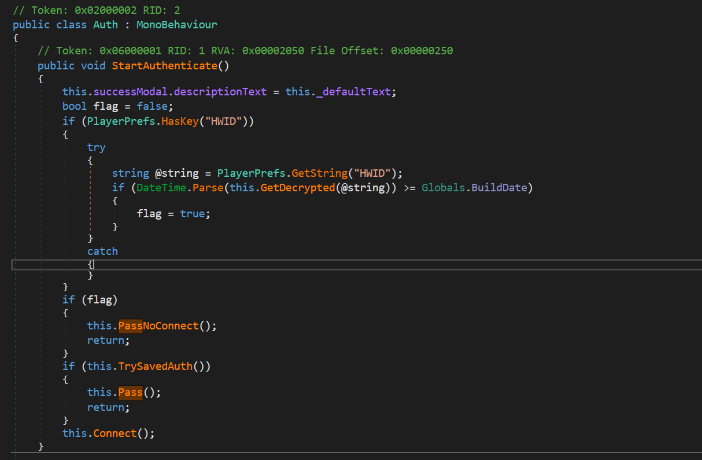

# HeatVR_AuthBypass
HWID Authentication for Anthro Heat VR Game.

# STATUS: Broken
Seems unity have changed the unique device id formula
https://stackoverflow.com/questions/55809274/how-do-i-get-same-hardware-id-as-in-unityengine-systeminfo-deviceuniqueidentifie

https://www.patreon.com/heatgame

Now in a more conventient powershell script instead of a .net executable.

## Steps
1. Download the HeatUnlocker.ps1 script
2. Verify the contents of the script
3. Run the script
4. Enjoy not needing to authentication via Patreon

If you have issues with the .Net parts of powershell maybe try installing the .Net runtime 
https://dotnet.microsoft.com/en-us/download/dotnet-framework/net48

## Explanation
Instead of patching the binary this makes use of the Auth class behaviour of a HWID in the PlayerPrefs allowing bypassing Patreon. Therefore this will work for all versions until they patch this mode of authentication out.
